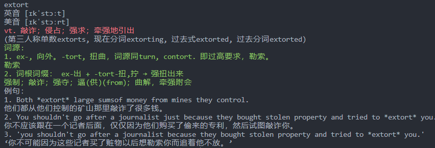

# Description

A simple and convenient python script to look up single English word.

# Usage

```bash
python3 translate.py <word>
```

# Example

```bash
python3 translate.py extort
```

result:


# Acknowledgement

Thanks to [有道词典](http://dict.youdao.com/) for providing the API.

Thanks to https://github.com/creatcode/api for the API document.
